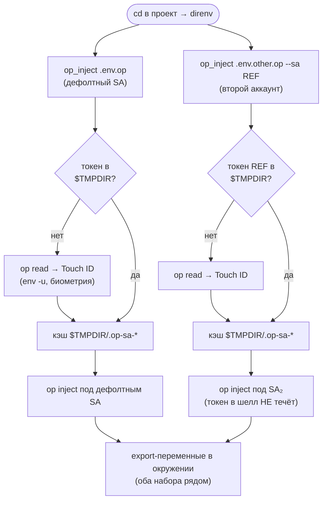
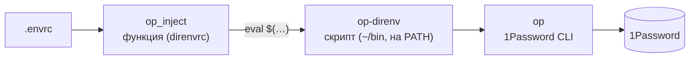
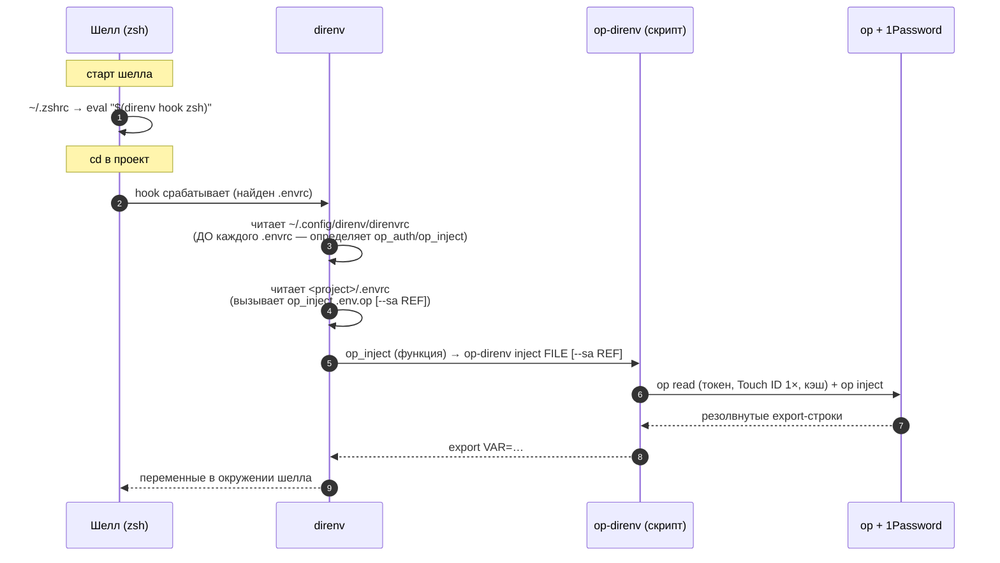

# op-direnv

Секреты из 1Password в shell без повторных запросов авторизации.

## Проблема

1Password CLI (`op`) при интеграции с десктопным приложением запрашивает Touch ID на **каждый** вызов `op read` / `op inject`. Если в `.envrc` несколько секретов — получаешь несколько промптов. При множестве открытых терминалов это превращается в постоянные запросы.

## Почему не 1Password Environments

У 1Password есть [Environments](https://developer.1password.com/docs/environments/) — встроенное решение для `.env` файлов. Но оно требует **копировать секреты** в отдельную сущность "Environment". Нельзя просто сослаться на существующий item в vault — нужно продублировать значение. Это неудобно: секрет обновляется в одном месте, но не обновляется в Environment, и наоборот.

`op-direnv` использует обычные `op://` ссылки на существующие items в vault'ах — один источник правды, без дублирования.

## Решение

Двухуровневая схема с Service Account (SA) token: токен читается один раз по Touch ID и кэшируется, дальше `op inject` работает без промптов.



1. Первый `cd` в проект → direnv вызывает `op_inject` → нужен SA token
2. `op_auth` делает `op read` через личный аккаунт → **Touch ID один раз**
3. SA token сохраняется в `$TMPDIR/.op-sa-*`
4. Все последующие `op inject` (в любом терминале) используют кэшированный SA token
5. После ребута — снова один Touch ID

## Требования

- [1Password CLI](https://developer.1password.com/docs/cli/) (`op`)
- [1Password desktop app](https://1password.com/downloads) с включённым "Integrate with 1Password CLI"
- [direnv](https://direnv.net/)
- Service Account в 1Password с доступом к нужным vault'ам

## Как создать Service Account

1. 1Password → Settings → Developer → Service Accounts → New Service Account
2. Дать доступ к vault'ам, из которых будут читаться секреты
3. Сохранить SA token как item в 1Password (например `op://Private/1pass-service-accounts/src-envs-shell`)

## Архитектура

Вся логика — в одном скрипте **`op-direnv`** (bash, кладётся в `$PATH`). Он шелл-независим и вызывается одинаково из direnv, из любого шелла, из CI:

```
op-direnv auth   [REF]               → печатает export OP_SERVICE_ACCOUNT_TOKEN=… (ambient-токен)
op-direnv inject FILE [--sa REF]     → печатает резолвнутые export-строки из FILE
op-direnv render SRC DEST [--sa REF] → пишет резолвнутый файл в DEST (kubeconfig и т.п.)
op-direnv exec   REF -- CMD…         → запускает CMD под SA-токеном REF (любой шелл)
```

`direnvrc` — лишь тонкие обёртки (`op_auth`, `op_inject`), чтобы `.envrc` читался коротко. Почему обёртки, а не «всё в скрипте»: дочерний процесс не может выставить переменную родителю, поэтому `export` обязан произойти в контексте, который исполняет `.envrc` (`eval "$(op-direnv inject …)"`).

Слои вызова (имена похожи, но это три разных уровня):



Порядок вызовов от старта шелла (кто кого зовёт и какой конфиг читается на каждом шаге):



Ключевое: `~/.zshrc` лишь **регистрирует hook** (один раз при старте). Сам hook на каждом `cd` запускает direnv, а уже direnv читает сначала `direnvrc` (общий), потом `.envrc` (проектный) — в одном bash-контексте.

## Установка

```bash
# 1. Скрипт на PATH
cp op-direnv ~/bin/op-direnv && chmod +x ~/bin/op-direnv   # или symlink

# 2. direnv-обёртки
cp direnvrc ~/.config/direnv/direnvrc

# 3. Указать свой дефолтный SA (если путь отличается от дефолта в скрипте)
echo 'export OP_DIRENV_DEFAULT_SA="op://Private/1pass-service-accounts/your-sa"' >> ~/.zshrc
```

## Использование

В каждом проекте создать два файла:

### `.env.op` — ссылки на секреты

```bash
export GITHUB_TOKEN="op://VaultName/item-name/field"
export DB_PASSWORD="op://VaultName/database/password"
```

### `.envrc` — загрузка через direnv

```bash
export AWS_PROFILE=myproject

# Секреты из 1Password
op_inject .env.op

# Kubernetes config с секретами (опционально)
op_inject .kube/config KUBECONFIG "$TMPDIR/kubeconfig-myproject"
```

Не забудьте `direnv allow` и добавить `.env.op` в `.gitignore` если vault/item пути приватные.

### Без direnv (только `.zshrc`/`.bashrc`)

Тот же скрипт, без direnv-обёрток. Добавьте в свой shell-профиль:

```bash
eval "$(op-direnv auth)"                 # ambient SA-токен, Touch ID один раз
eval "$(op-direnv inject ~/.env.op)"     # секреты резолвятся при старте шелла
```

Создайте `~/.env.op`:

```bash
export GITHUB_TOKEN="op://VaultName/item-name/field"
```

При открытии первого терминала — Touch ID один раз. Все последующие терминалы подхватят кэшированный SA token без промптов.

## Подводные камни

Три ловушки, на которых легко застрять. Если что-то «не работает» — почти всегда одна из них.

### 1. Забыли `export` — переменной нет в окружении

```bash
GITHUB_TOKEN="op://Vault/item/field"          # ❌ переменная появляется и тут же пропадает
export GITHUB_TOKEN="op://Vault/item/field"   # ✅
```

`op_inject` делает `eval` строк файла. `VAR=value` создаёт **локальную** переменную шелла; direnv переносит в твой шелл только **экспортированные**. Без `export` секрет резолвится молча, но в `env` его не будет. Симптом: `env | grep VAR` пусто, ошибок нет.

### 2. `op inject` сканирует `op://` даже в КОММЕНТАРИЯХ

`op inject` — это текстовая подстановка по всему файлу, ему всё равно, что строка закомментирована для шелла.

```bash
# пример: op://Vault/item/field   ← ❌ direnv упадёт: invalid secret reference
```

- Невалидная `op://`-ссылка в комментарии → `[ERROR] invalid secret reference` при `direnv allow`.
- Даже `op://.` из обычного предложения в комментарии будет распознано как ссылка.
- Валидная закомментированная ссылка молча резолвится впустую (лишний запрос).

**Правило:** в `.env.op` не пиши `op://` в комментариях вообще — реальная ссылка только в живой `export`-строке.

### 3. Service Account не читает чужой biometric-vault

SA-токен имеет доступ только к выданным ему vault'ам. Сам токен лежит в `Private` (biometric-only), куда SA доступа НЕ имеет. Поэтому `op_auth` читает токен через `env -u OP_SERVICE_ACCOUNT_TOKEN` — то есть сняв активный токен, чтобы сработала биометрия. Если убрать `env -u`, переключение на второй аккаунт упадёт.

## Несколько аккаунтов

Один SA-токен = один 1Password-аккаунт; один вызов `op` = один токен. Но в одном `.envrc` можно подтянуть секреты из **двух** аккаунтов: резолвим первый файл под токеном A, второй — под токеном B. Оба набора окажутся в окружении одновременно.

1. Создай Service Account во **втором** аккаунте, дай доступ к нужному vault.
2. Сохрани его токен как item в своём личном `Private` (например `op://Private/1pass-service-accounts/other-account`).
3. В `.envrc` — тот же `op_inject`, с флагом `--sa`:

```bash
op_inject .env.op                                                     # первый аккаунт (дефолтный SA)
op_inject .env.other.op --sa "op://Private/1pass-service-accounts/other-account"   # второй аккаунт
```

С `--sa` аутентификация происходит внутри дочернего процесса `op-direnv` — токен второго аккаунта **не попадает** в твой шелл, и ручной `op` продолжает работать с первым аккаунтом.

### Ручной `op` против второго аккаунта

`op-direnv exec` работает в любом шелле:

```bash
op-direnv exec "op://Private/1pass-service-accounts/other-account" -- op item list --vault OtherVault
```

Для краткости — алиас в своём профиле (опционально):

```bash
alias op2='op-direnv exec op://Private/1pass-service-accounts/other-account -- op'
# op2 item list --vault OtherVault
```

Кэш токена общий с direnv → Touch ID максимум один раз за сессию.

## Как это работает

Логика — в скрипте `op-direnv` (см. `op-direnv --help`). `direnvrc` — обёртки над ним.

### `op_auth [ref]` (обёртка над `op-direnv auth`)

Получает SA token через `op read` (биометрия), кэширует в `$TMPDIR/.op-sa-*`, выставляет ambient `OP_SERVICE_ACCOUNT_TOKEN`. При повторном вызове — из кэша.

### `op_inject src [--sa ref]` (обёртка над `op-direnv inject`/`render`)

- `op_inject .env.op` — резолвит `op://` ссылки и экспортирует переменные (дефолтный SA).
- `op_inject .env.op --sa "op://…/other"` — то же, но под указанным SA (второй аккаунт); токен в шелл не течёт.
- `op_inject .kube/config KUBECONFIG /tmp/kube` — резолвит файл, пишет на диск, экспортирует переменную (тоже принимает `--sa`).

### Токен читается со снятым `OP_SERVICE_ACCOUNT_TOKEN`

`op-direnv` всегда делает `env -u OP_SERVICE_ACCOUNT_TOKEN op read REF` — токен-item лежит в biometric-vault (Private), куда сам SA доступа не имеет. Без этого переключение на второй аккаунт падает (см. [Подводные камни №3](#3-service-account-не-читает-чужой-biometric-vault)).

## Файлы

| Файл | Назначение |
|------|-----------|
| `op-direnv` | Скрипт со всей логикой → `~/bin/op-direnv` (на PATH) |
| `direnvrc` | Обёртки `op_auth`/`op_inject` → `~/.config/direnv/direnvrc` |
| `example.envrc` | Пример `.envrc` для проекта |
| `example.env.op` | Пример `.env.op` со ссылками на секреты |
